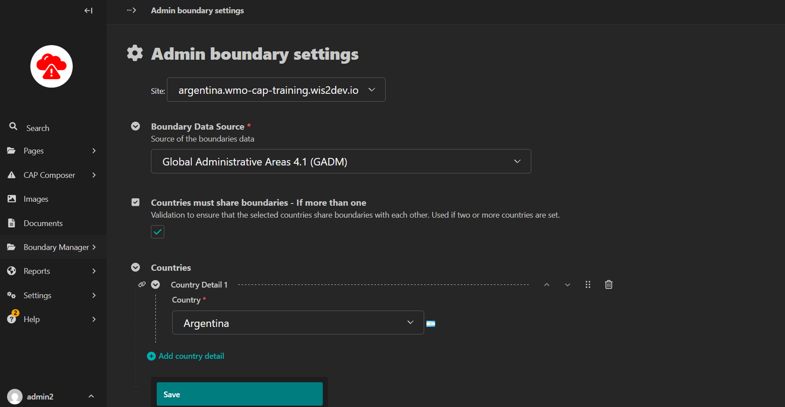
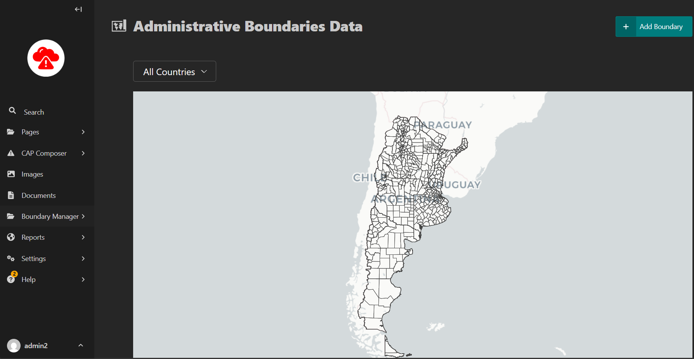

Setting Boundaries
==================

This section guides you on how to set up boundaries which are useful in creating alerts as they make it easier to select the Area affected by events.

**NOTE: Only admin users should access the boundary settings.**

The Boundary Manager allows for the addition of boundaries to be used in the creation of an alert area using the Admin Boundary Settings.

.. image:: ../_static/images/cap_composer_boundary_manager.png
      :alt: WMO CAP Composer Boundary Manager

There you will configure the boundary settings for your country, an example is shown below:

Now you have to load the boundary data to your site. For that you will go back to the Boundary Manager panel and now select the Boundary Data option.

Inside the Boundary Data page, you will see the option to add a boundary. Click on the Add Boundary button to upload the boundary data.

Then you will download the boundaries from the source selected in the Boundary Settings page. In this case:

- Global Administrative Areas 4.1 (GADM) https://gadm.org/download_country.html

After downloading choose the correct file and click on the Upload button.

.. image:: ../_static/images/cap_composer_boundary_loader.png
      :alt: WMO CAP Composer Boundary Loader

After the upload is complete, you will see the boundary data in the Boundary Data page.