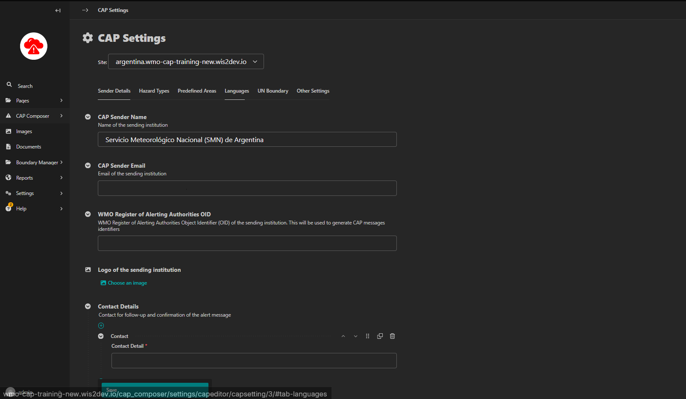

Configuration
=============

These are common details that are repeated across the CAP Composer tool and are set only once per country.

Sender Details
--------------

These include:

1. CAP Sender name - Name of the sending institution
2. CAP Sender email - Email of the sending institution
3. The WMO Register of Alerting Authorities OID is used to generate the identifier each CAP Alert - This is the official OID assigned to each country in the [WMO register of alerting authorities](https://alertingauthority.wmo.int/authorities.php)
4. Logo of the institution
5. Contact details- 

Hazard Types
--------------

Here the NMHSs input the different types of hazards they monitor. They can select the hazards from a WMO predefined list of hazards or create a new custom hazard/event type. Each hazard type can be associated with an Icon, a Category and an Event Code

Predefined Areas
----------------

Here you can create a list of common regions that are known to experience alerts. This will save you time so that you do not have to draw the same area each time for new alerts. 

 **NOTE:**
 
 While drawing a boundary, if the area falls out of the UN Boundaries set, a warning and button will appear to snap the area back to the UN Boundaries. Snapping boundaries back to the UN Boundary ensures that the CAP Alert is displayed on Severe Weather and Information Centre (SWIC) platform. To set up UN Boundaries, refer to [Setting up UN Boundary](#un-boundary) section.

Languages
-----------

To add one or more languages, the Language code such as es and Language name such as Spanish. This languages will be useful when creating multiple Alert Infos for a CAP Alert where one alert info corresponds to another one Alert info by its translated language.

UN Boundary
--------------

This section allows you to upload a GeoJSON file of the UN Country Boundary. Setting this will enable the UN Country Boundary check in the alertdrawing tools.

Other Settings
---------------

Here you can limit the number of CAP Alerts that can are displayed at the same time on the website, reducing it will help to improve performance.

