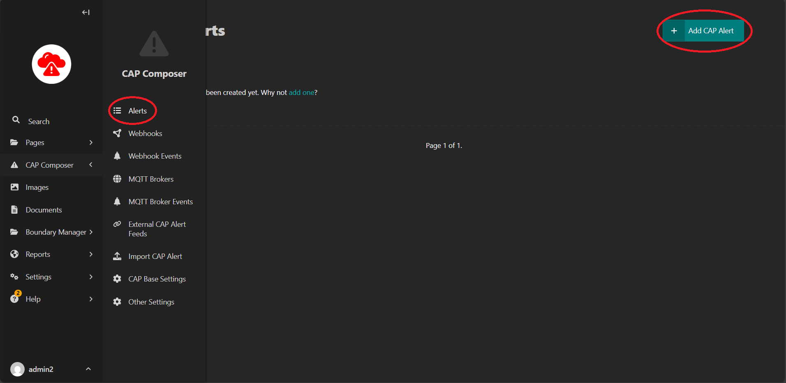
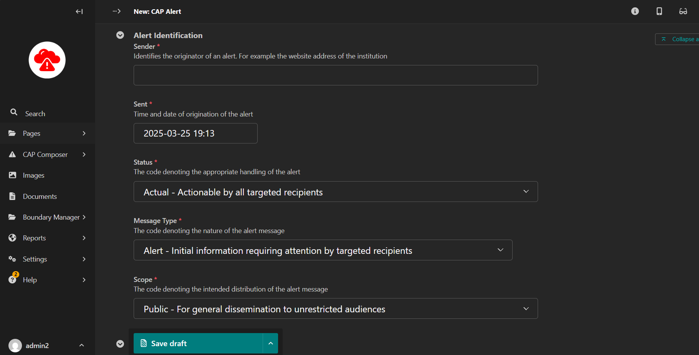
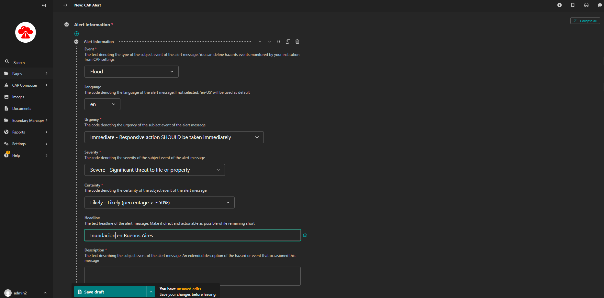
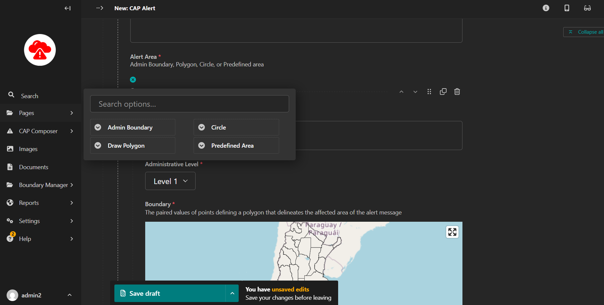
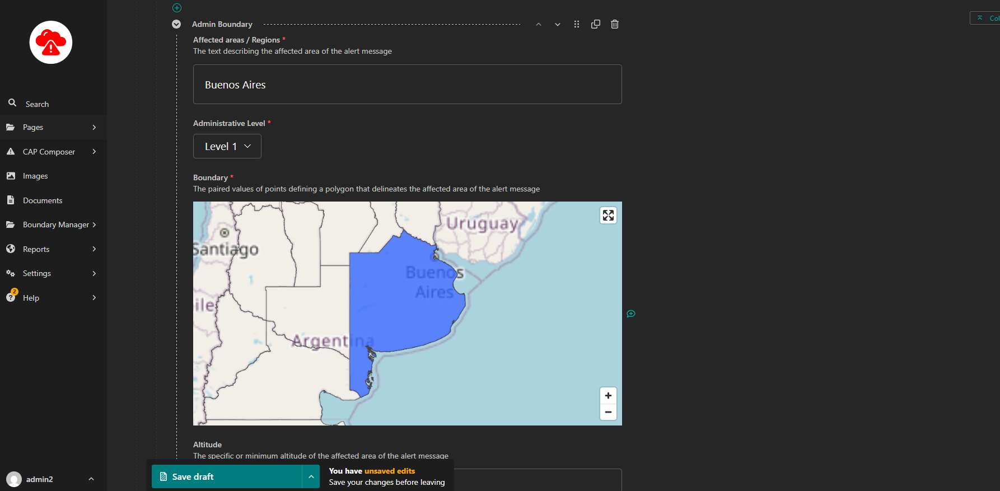
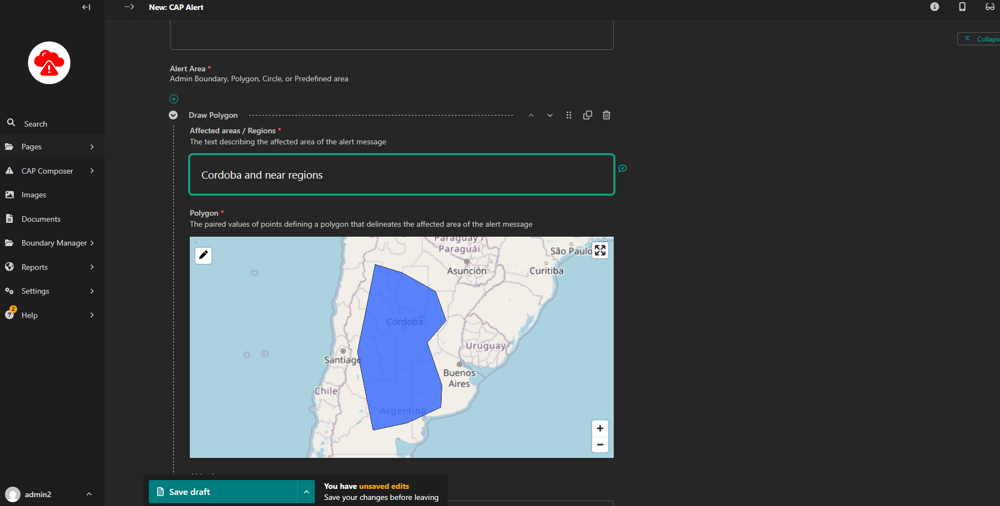
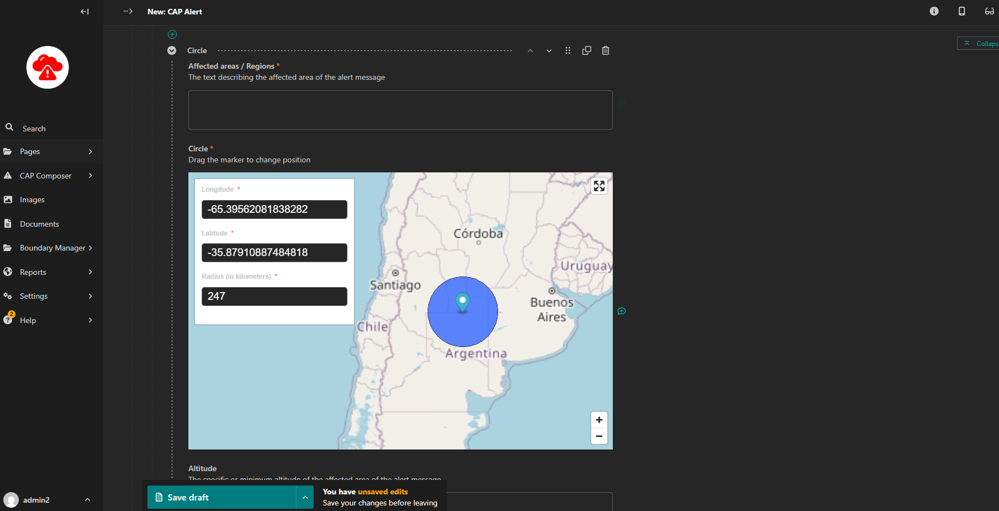
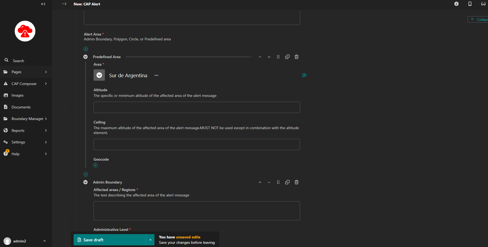
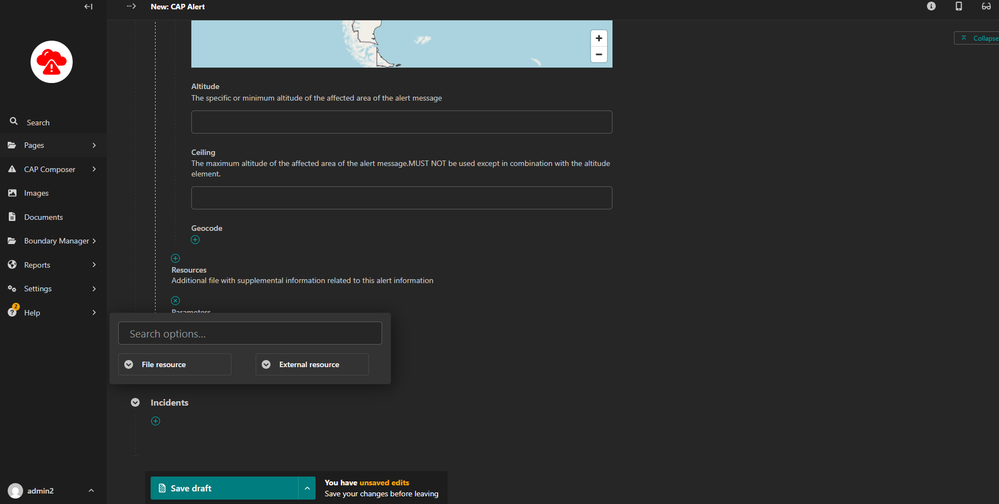
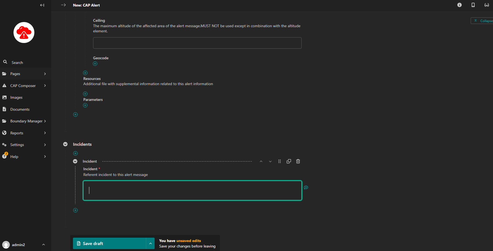

Creating and Issuing Alerts
===========================

To create a CAP Alert access the CAP composing interface from the explorer menu as below and add a new cap alert page:

How to compose a CAP Alert
--------------------------

A CAP Alert is composed of the following sections:

- Alert Identification
- Alert Information
- Alert Area
- Alert Resource
- Additional CAP Inputs
- Incidents

Alert Identification
^^^^^^^^^^^^^^^^^^^^

It contains the following entities required for a valid CAP message:

- Sender ID(sender),
- Sent Dat/Time (sent),
- Message Status (status),
- Message Type (msgType),
- Scope(scope),
- Restriction (restriction),
- Addresses (addresses),
- Note (note),
- Reference IDs (references) and
- Incident ids (incidents).

The alert identifier is generated automatically and is not editable.

 **NOTE: Some fields are visible based on selection of different parameters.**

Alert Information
^^^^^^^^^^^^^^^^^

Corresponds to the *info* element in the CAP message. The *info* entity specifies the alert's details. At least
one *info* block is required for an alert.

Each *info* block contains the following elements:

- Language (language)
- Event Type (event)
- Response Type/Types (responseType)
- Urgency (urgency)
- Severity (severity)
- Certainty (certainty)
- Audience (audience)
- Effective Date/Time (effective)
- Onset Date/Time (onset)
- Expiration Date/Time (expires)
- Sender Name (senderName)
- Headline(headline)
- Event description (description)
- Instructions (instruction)
- Contact Info (contact)
- Parameter/Parameters(parameter)

Alert Area
^^^^^^^^^^

Information Entity that defines the geographic area to be notified. Multiple areas can be defined in the alert. Each
area contains the following elements:

- Area Description (areaDesc)
- Area Polygon/Polygons (polygon)
- Area Circle/Circles (circle)
- Predefined Area (predefined)
- Altitude (altitude)
- Ceiling (ceiling)
- Geocode (geocode)

The Alert area input has 4 selector options:

- Admin Boundary (area is picked from predefined boundaries). To use this option, ensure that admin boundaries are
  initially loaded. Refer to [Setting up boundaries](./Setting-Boundaries.md) section.

- Polygon (drawing a polygon). 

- Circle (drawing a circle which specifies the latitude, longitude and radius)

- Predefined Area (assuming it was configured in the CAP Base Settings)

Alert Resource
^^^^^^^^^^^^^^

Entity that defines supplemental information related to an *info* object Multiple instances of this section are allowed.
It contains:

- Description (resourceDesc), MIME Type (mimeType), File Size (size), URI (uri), Dereferenced URI (derefUri) and
  Digest (digest)

The Alert resource input has 2 selector options:

- File resource (takes in a file and description)
- External resource

Additional CAP Inputs
^^^^^^^^^^^^^^^^^^^^^

Addition alert information elements include parameters and event codes

Incidents
^^^^^^^^^

This defines the reference incident to the current alert, if any.

Review and Approval
-------------------

After drafting the alert, it should be reviewed by an approver before it is published. The approver should ensure that the alert is accurate and complete before approving it for publication.