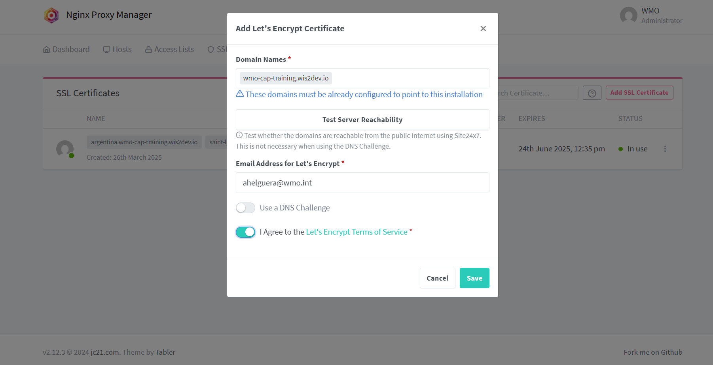
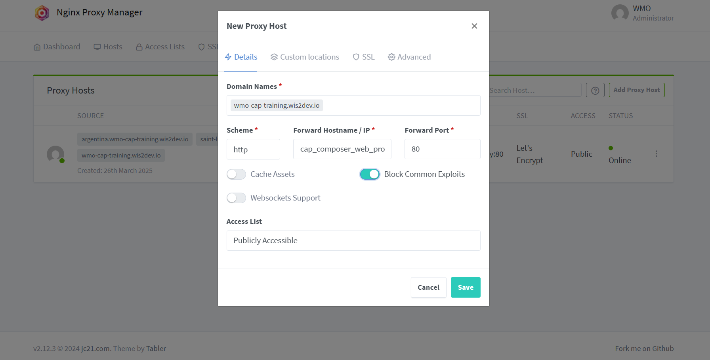
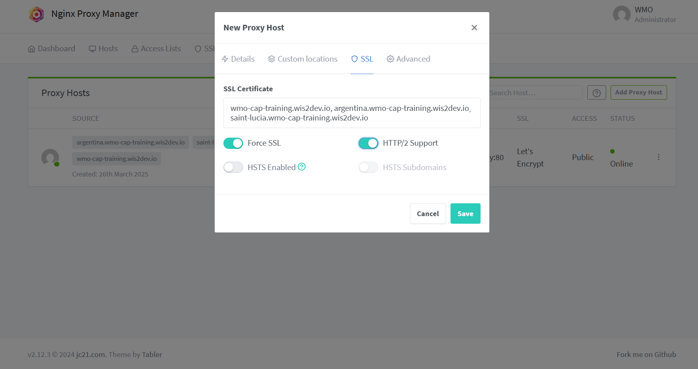

Securing your installation
==========================

To use the WMO CAP Composer in a production environment and send out CAP alerts, you need to secure your installation by setting up SSL on your website.
This section will guide you through the process of securing your installation.

You will need to make sure you have configured a Domain Name System (DNS) record for your website and that the domain name points to the IP address of your server.

Setting up SSL
--------------

The standalone docker-compose stack included in this repository includes the `Nginx Proxy Manager <https://nginxproxymanager.com/>` to help you setup SSL on your website.

By default this container will be listening on port 81, you can access the Nginx Proxy Manager by visiting `http://<your_ip_or_domain>:81`.
There you will have to login using your credentials, in case it's the first time the default credentials are *User:admin@example.com* with *Password:changeme* and you will be prompted to change the password.

Once you are logged in, you will see the Nginx Proxy Manager dashboard, click on the `SSL Certificates` tab and then click on the `Add SSL Certificate` button. In this example Let's Encrypt was selected to produce the certificate.

After saving the certificate, you will then go to the `Dashboard` select the `Proxy Hosts` tab and click on the `Add Proxy Host` button.

There you will fill the form with your own domain name considering that the Forwarding Hostname is included as *cap_composer_web_proxy* in port *80*. The following is an example:

After filling this form go to the SSL section where you will fill the form in order to add the certificate you created before.

After saving the proxy host, you will see the new host in the list. You can now access your CAP Composer using your domain name and with SSL enabled.

Finally go to the `Settings` tab and set the *Default Site* to Redirect to `https://<your_domain_name>` and save the changes.

2-Factor Authentication
------------------------

The CAP Composer includes the `wagtail-2fa Django App <https://github.com/labd/wagtail-2fa>`_ to support 2-Factor Authentication for logging into the Wagtail admin site.

To enable 2-Factor Authentication all Wagtail Admin users edit .env file and set the following variable:

.. code-block:: shell

   WAGTAIL_2FA_REQUIRED=True

After setting this variable, restart the docker containers:

.. code-block:: shell

   docker compose down
   docker compose up -d

Now when you try to login using the users created with the `createsuperuser` command you will be prompted to setup 2-Factor Authentication.

To enable or disable 2-Factor Authentication for a group, you can use the checkbox in the group permissions.