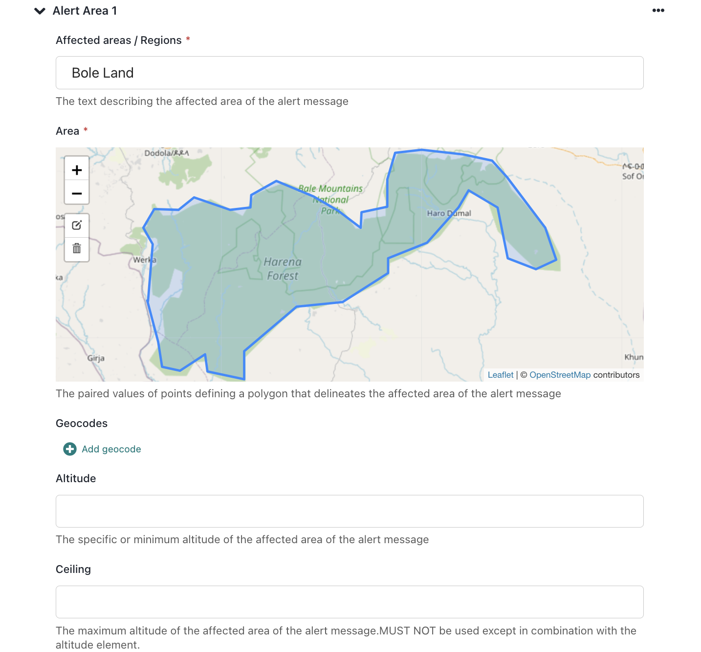

# CAP Editor   

A Wagtail Commmon Alerting Protocol (CAP) Editor python package
installable as an app on any wagtail project (version\>=4.1).

The **Common Alerting Protocol (CAP)** provides an open, non-proprietary
digital message format for all types of alerts and notifications. It
does not address any particular application or telecommunications
method. The CAP format is compatible with emerging techniques, such as
Web services, as well as existing formats including the Specific Area
Message Encoding (SAME) used for the United States' National Oceanic and
Atmospheric Administration (NOAA) Weather Radio and the Emergency Alert
System (EAS)

The CAP xml response follows the structure of the schema provided at
http://docs.oasis-open.org/emergency/cap/v1.2/CAP-v1.2-os.html

# Contents

-   [CAP Editor](#cap-editor){#toc-cap-editor}
    -   [Quick start](#quick-start){#toc-quick-start}
    -   [Usage](#usage){#toc-usage}
        -   [Creating a CAP
            Alert](#creating-a-cap-alert){#toc-creating-a-cap-alert}
        -   [Sections in the Alert Page and corresponding
            XML](#sections-in-the-alert-page-and-corresponding-xml){#toc-sections-in-the-alert-page-and-corresponding-xml}
        -   [A. Alert
            Identification](#a.-alert-identification){#toc-a.-alert-identification}
        -   [B. Alert Info](#b.-alert-info){#toc-b.-alert-info}
        -   [C. Alert Area](#c.-alert-area){#toc-c.-alert-area}
        -   [D. Alert
            Resource](#d.-alert-resource){#toc-d.-alert-resource}
    -   [Integrations](#integrations){#toc-integrations}
    
## Quick start

#### 1. Clone repository

``` sh
git clone https://github.com/wmo-raf/cap-editor.git
```

#### 2. Install in virualenvironment using pip

``` sh
pip install path_to/capeditor/dist/capeditor-{version}.tar.gz
```

#### 3. Configure settings

In your `settings.py` or `settings/base.py`, within the installed apps,
include the `rest_framework, rest_framework_xml` and `capeditor` as
below:

``` py
INSTALLED_APPS = [
    # ...
    'rest_framework',
    'rest_framework_xml',
    'capeditor'
]
```

Set up restframeworkxml renderers

``` py
REST_FRAMEWORK = {
    'DEFAULT_RENDERER_CLASSES': (
        'rest_framework.renderers.JSONRenderer',
        'rest_framework_xml.renderers.XMLRenderer',  # add XMLRenderer
    ),
    'DEFAULT_PARSER_CLASSES': (
        'rest_framework_xml.parsers.XMLParser',
    ),
}
```

#### 4. Include the cap urls

In `urls.py`, include the cap urls as below. This is where the cap api
for listed (`/cap/caps.xml`) and detailed(`/cap/{cap_id}.xml`) cap view
will be hosted.

``` py
from capeditor import urls as cap_urls

urlpatterns = [
    # ...
    path('cap', include(cap_urls))

]
```

#### 5. Run model migrations

``` sh
python manage.py migrate
```

## Usage

### Creating a CAP Alert

With capeditor successfully installed, both the Alert Listing page and
Alert Detail page will be available on wagtail admin interface.

    - AlertList
       |_ Alert 1
       |_ Alert 2

Create an `Alert Listing Page` by adding it as a child page and
specifying the title of the page. This page will host a list of all
alerts created.


Create one or more `Alert Page` by adding it as a child to the
`Alert Listing Page`


------------------------------------------------------------------------

### Sections in the Alert Page and corresponding XML

The overall Document Object Model of an alert is as below:


### A. Alert Identification

This is the root section of CAP corresponds to:

``` xml
<alert>
    <!-- ... -->
</alert>
```

It contains the **Message ID (identifier), Sender ID(sender), Sent
Dat/Time (sent), Message Status (status), Message Type (msgType), Scope
(scope), Restriction (restriction), Addresses (addresses), Note (note),
Reference IDs (references) and Incident ids (incidents)**.

***NOTE:*** Some fields are visible based on selection of different
parameters.


### B. Alert Info

This is an optional child section of the Alert Identification Section
i.e

``` xml
<alert>
    <!-- ... -->
    <info></info>
    <info></info>
</alert>
```

Multiple instances of this section are allowed. It contains the
**Langauge (langauge), Event Category/Categories (category), Event Type
(event), Response Type/Types (responseType), Urgency (urgency), Severity
(severity), Certainty (certainty), Audience (audience), Event Code/Codes
(eventCode), Effective Date/Time (effective), Onset Date/Time (onset),
Expiration Date/Time (expires), Sender Name (senderName), Headline
(headline), Event description (description), Instructions (instruction),
Information URL (web), Contact Info (contact) and Parameter/Parameters
(parameter)**.

### C. Alert Area

This is an optional child section of the Alert Info Section i.e

``` xml
<alert>
    <!-- ... -->
    <info>
        <area></area>
        <area></area>
    </info>
    <info>
        <area></area>
    </info>
</alert>
```

Multiple instances of this section are allowed. It contains the **Area
Description (areaDesc), Area Polygon/Polygons (polygon), Area
Circle/Circles (circle), Area Geocode/Geocodes (geocode), Altitude
(altitude), Ceiling (ceiling)**.



### D. Alert Resource

This is an optional child section of the Alert Info Section i.e

``` xml
<alert>
    <!-- ... -->
    <info>
        <resource><resource>
        <resource><resource>
        <area></area>
        <area></area>
    </info>
    <info>
        <resource><resource>
        <area></area>
    </info>
</alert>
```


Multiple instances of this section are allowed. It contains the
**Description (resourceDesc), MIME Type (mimeType), File Size (size),
URI (uri), Dereferenced URI (derefUri) and Digest (digest)**

## Integrations

To integrate the alerts to another wagtail page and include in
templates, for example in the home page follow the instructions below:

Call the alerts in your models.py under the 'get_context' method:

``` py
from capeditor.models import Alert

class HomePage(Page):

    # ...


    def get_context(self, request, *args, **kwargs):
        context =super().get_context(request, *args, **kwargs)
       
        context['alerts'] = Alert.objects.live().public()
        context['latest_alerts'] = context['alerts'][:3]
        return context  
```

Parse the alerts in the home template:

``` django


    
    <p>{{alert.sent}}</p>

    <!-- info list  -->
    
        

            <p>{{info.event}}</p>
            <p>{{info.get_severity_display}}</p>

            <!-- area list  -->
            
                <p>{{alert_area.areaDesc}}</p>
                <p>{{ alert_area.area }}</p>
            

            <!-- other fields  -->

        
    

```
